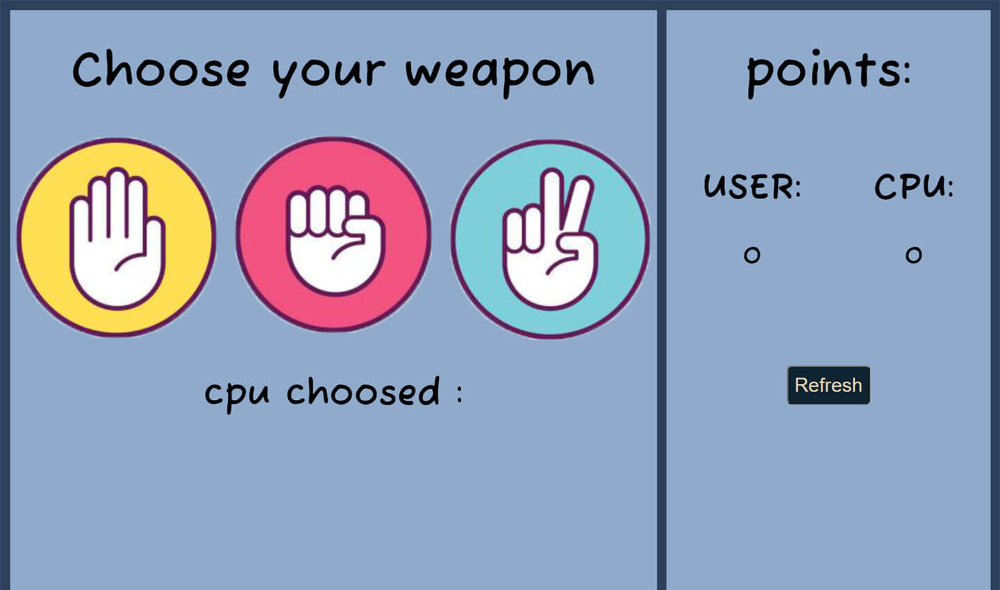

# Rock, Paper, Scissors

Users could be able to:

- select one of the options, after that CPU makes his choice and then according to the selections the result is displayed in the points section. By clicking the REFRESH button, or by pressing the R key on the keyboard, The game will continue and points will be collected.

### Screenshot

## Links

- Live Site URL: [Let's Play](https://hamed3958.github.io/Rock-Paper-Scissors/)

### Built with

- HTML5
- CSS_Grid
- JavaScript

## Author

- Website - [hamedasadiasl.ir](http://hamedasadiasl.ir/)
- Github - [@hamed3958](https://github.com/hamed3958)
- LinkedIn - [Hamed Asadi Asl](https://www.linkedin.com/in/hamed-asadi-asl/)
